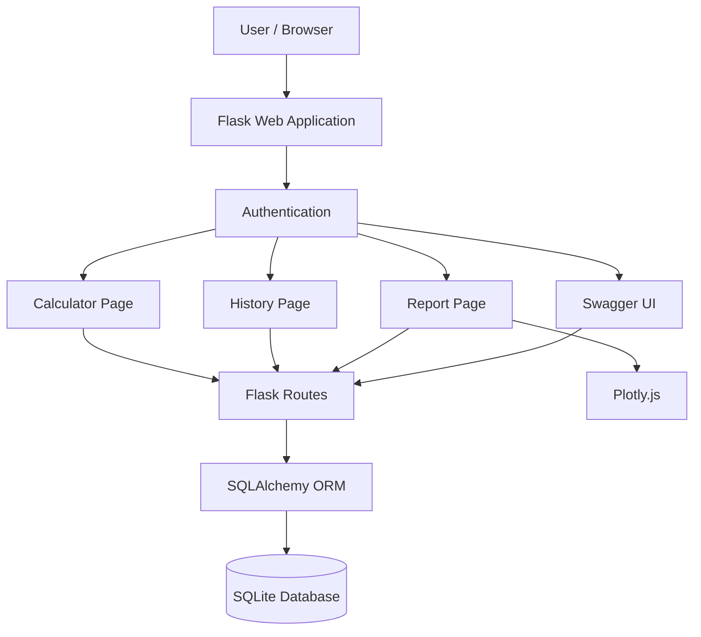
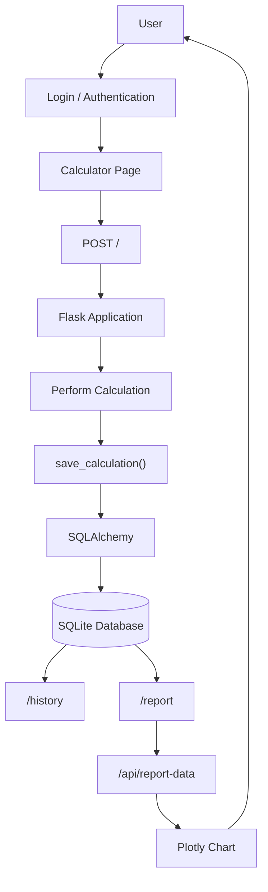
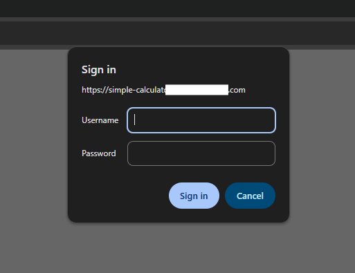
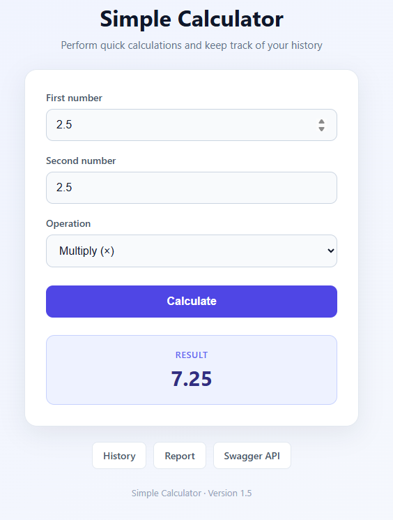
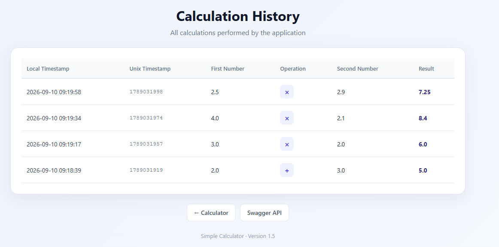
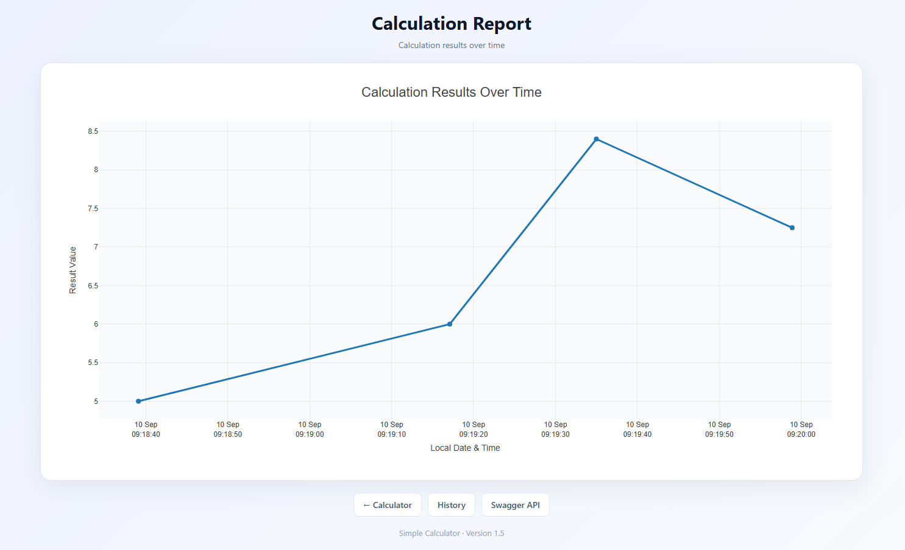
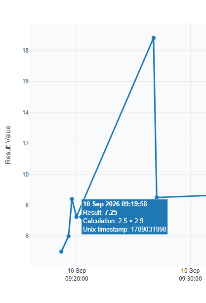
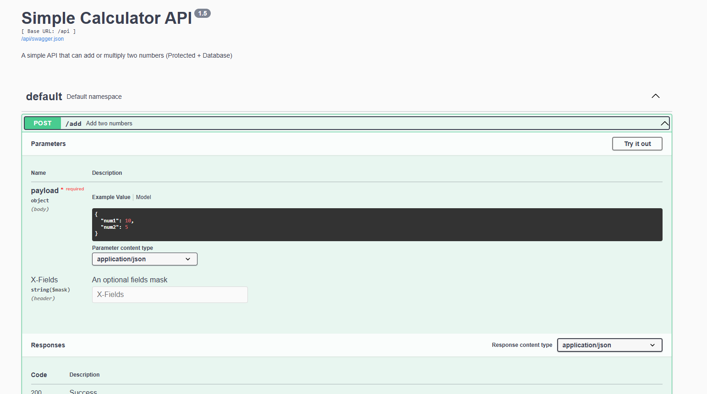
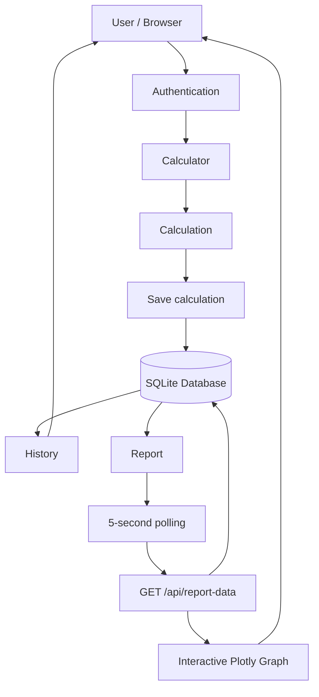

# Simple Calculator Web Application

A simple web-based calculator application built with **Python, Flask, SQLAlchemy, and SQLite**.

The application provides a calculator interface, calculation history, an interactive report showing calculation results over time, and a Swagger/OpenAPI interface for the API.

The application can be developed locally using **uv** and deployed to Render through GitHub.

---

# Features

The application currently provides the following functionality:

- Addition of two numbers
- Multiplication of two numbers
- Calculation result display
- Automatic storage of calculations in the database
- Calculation history page
- Interactive calculation report
- Local datetime and Unix timestamp storage
- Interactive Plotly graph
- Hover information on graph points
- Automatic report updates every 5 seconds
- Swagger/OpenAPI API documentation
- HTTP Basic Authentication
- Application version displayed in the web interface
- Local development using `uv`
- GitHub-based source control
- Deployment to Render

---

# Technology Stack

| Component | Technology |
| --- | --- |
| Programming language | Python |
| Web framework | Flask |
| Database ORM | Flask-SQLAlchemy |
| Database | SQLite |
| Project/package management | uv |
| Interactive graph | Plotly.js |
| API documentation | Swagger UI |
| Source control | Git / GitHub |
| Hosting | Render |

---

# Architecture

The application follows a simple web application architecture.



---

# Data Flow

The following diagram shows how a calculation moves through the application.



---

# Project Structure

A typical project structure is:

```text
simple-calculator/
│
├── app.py
├── calculator.db
├── pyproject.toml
├── uv.lock
├── README.md
│
├── templates/
│   ├── index.html
│   ├── history.html
│   └── report.html
│
├── docs/
│   └── screenshots/
│       ├── login.png
│       ├── calculator.png
│       ├── history.png
│       ├── report.png
│       └── swagger.png
│
└── ...
```

---

# Requirements

The following tools are required for local development:

- Python
- uv
- Git

A GitHub account is required for GitHub-based deployment.

A Render account is required for deployment to Render.

---

# Install Dependencies

Install Flask:

```bash
uv add flask
```

Install Flask-SQLAlchemy:

```bash
uv add flask-sqlalchemy
```

Install the Swagger UI dependency:

```bash
uv add flask-swagger-ui
```

---

# Running the Application

Run the application locally:

```bash
uv run flask run
```

The application will normally be available at:

```text
http://127.0.0.1:5000
```

Open the URL in a web browser and log in using the configured credentials.

---

# Application Pages

## Login

The application requires authentication before accessing protected functionality.

The login page is the entry point for users.

<!-- SCREENSHOT: Save the login page screenshot as:
     docs/screenshots/login.png
-->



---

## Calculator

The main calculator page is:

```text
/
```

Example:

```text
http://127.0.0.1:5000/
```

The user can enter:

- First number
- Second number
- Operation

Currently supported operations are:

```text
Addition
Multiplication
```

The calculation is performed by the Flask application and the result is displayed to the user.

<!-- SCREENSHOT: Save the calculator screenshot as:
     docs/screenshots/calculator.png
-->



---

# Calculation History

The history page is:

```text
/history
```

Example:

```text
http://127.0.0.1:5000/history
```

The page displays previously stored calculations.

The table includes:

- Local timestamp
- Unix timestamp
- First number
- Operation
- Second number
- Result

The calculations are retrieved from the database.
<!-- SCREENSHOT: Save the history screenshot as:
     docs/screenshots/history.png
-->



---

# Calculation Report

The report page is:

```text
/report
```

Example:

```text
http://127.0.0.1:5000/report
```

The report provides an interactive Plotly graph.

<!-- SCREENSHOT: Save the report screenshot as:
     docs/screenshots/report.png
-->


## Horizontal Axis

The horizontal axis represents:

```text
Local Date & Time
```

## Vertical Axis

The vertical axis represents:

```text
Result Value
```

Each calculation is represented as a point on the graph.

---

# Interactive Graph

The report graph provides interactive hover information.

When the user moves the mouse over a point, information about that calculation is displayed.

The hover information includes:

- Local timestamp
- Result
- Calculation
- Unix timestamp

Example:

```text
10 Sep 2026 10:15:32

Result: 15

Calculation: 10 + 5

Unix timestamp: 1789031732
```

<!-- SCREENSHOT: Save the interactive graph screenshot as:
     docs/screenshots/interactivegraph.png
-->


---

# Automatic Report Updates

The report page automatically checks for new calculation data every **5 seconds**.

The browser requests:

```text
/api/report-data
```

every five seconds.

The flow is:

```text
Report page
     │
     │ Every 5 seconds
     ▼
/api/report-data
     │
     ▼
Database
     │
     ▼
Latest calculations
     │
     ▼
Plotly chart
```

This means that if the calculator and report pages are open simultaneously, a newly performed calculation will appear on the report page automatically.

A manual page refresh is not required.

---

# API

The application provides API functionality in addition to the web interface.

Swagger UI is available at:

```text
/swagger
```

Example:

```text
http://127.0.0.1:5000/swagger
```

Swagger provides an interactive interface for viewing and testing the API.

<!-- SCREENSHOT: Save the Swagger screenshot as:
     docs/screenshots/swagger.png
-->


---

# Report Data API

The report uses the following endpoint:

```text
GET /api/report-data
```

The endpoint returns calculation data in JSON format.

Example response:

```json
{
    "calculations": [
        {
            "id": 1,
            "local_timestamp": "2026-09-10T10:48:20",
            "unix_timestamp": 1789030100,
            "num1": 10,
            "num2": 5,
            "operation": "add",
            "result": 15
        }
    ]
}
```

The report page uses this endpoint to retrieve the latest calculation data.

---

# Database

The application currently uses SQLite.

The database file is:

```text
calculator.db
```

SQLAlchemy is used as the ORM between Flask and SQLite.

The calculation data includes information such as:

```text
id
num1
num2
operation
result
unix_timestamp
local_timestamp
```

Conceptually:

```text
Calculation
│
├── id
├── num1
├── num2
├── operation
├── result
├── unix_timestamp
└── local_timestamp
```

---

# Security

Security is an important part of the application because the calculator, calculation history, report, and API contain application data.

## Authentication

The application uses authentication to restrict access to the application.

Users must authenticate before accessing protected application functionality.

The authentication mechanism is implemented at the Flask application level.

---

## Protected Routes

Authentication is applied before requests are processed.

This prevents unauthenticated users from directly accessing protected pages or API endpoints.

Examples of protected functionality include:

```text
/
 /history
 /report
 /api/report-data
 /swagger
```

---

## Credentials

For deployment, sensitive configuration is supplied through environment variables on the hosting platform's secret/environment-variable configuration.

---

# Application Version

The application has an application version defined in the Flask application.

The version is displayed in the web interface.

For example:

```text
Simple Calculator · Version 1.3
```

Updating the application version makes it easier to identify which version is currently deployed.

---

# Development Workflow

A typical development workflow is:

```text
Make changes
     │
     ▼
Test locally
     │
     ▼
Commit changes
     │
     ▼
Push to GitHub
     │
     ▼
Render detects changes
     │
     ▼
Application redeployed
```

---

# Git Workflow

Check the current Git status:

```bash
git status
```

Add changed files:

```bash
git add .
```

Create a commit:

```bash
git commit -m "Update calculator application"
```

Push the changes:

```bash
git push
```

---

# Deployment on Render

The application can has been deployed to Render using the GitHub repository.

General deployment process:

1. Push the project to GitHub.
2. Create a new Web Service in Render.
3. Connect the GitHub repository.
4. Configure the Python environment.
5. Configure the build command.
6. Configure the start command.
7. Configure required environment variables.
8. Deploy the application.

After deployment, Render provides a public URL for the application.

---

# Render and SQLite

The application currently uses SQLite.

SQLite is convenient for local development because the database is stored as a file:

```text
calculator.db
```

However, when deploying a web application to Render, filesystem persistence should be considered carefully.

For reliable long-term production data storage, a managed database such as PostgreSQL is generally more appropriate than relying on an SQLite file on the web service filesystem.

---

# Main Endpoints

| URL                | Description                    |
| ------------------ | ------------------------------ |
| `/`                | Calculator                     |
| `/history`         | Calculation history            |
| `/report`          | Interactive calculation report |
| `/api/report-data` | Report data API                |
| `/swagger`         | Swagger API documentation      |

---

# Future Improvements

Possible future improvements include:

- PostgreSQL database
- Database migrations
- Pagination for calculation history
- Search and filtering
- Date/time filtering for reports
- Clear-history functionality
- CSV export
- Downloadable reports
- Additional mathematical operations
- User accounts
- Role-based access control
- Improved API functionality
- More advanced reporting
- Application monitoring
- Automated testing
- Improved error handling

---

# Complete Application Data Flow



---

# Author

```text
Author: Hamed Madadian (eng.madadian@gmail.com)
```
